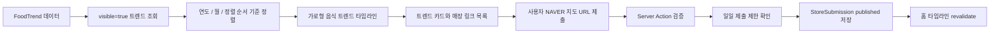

<p align="center">
  
</p>

<!-- TODO: Add the README hero image at docs/assets/readme/korean-food-trends-banner.png. -->

<h1 align="center">Korean Food Trends</h1>

<p align="center">
  <strong>한국 음식 트렌드와 관련 매장 링크를 연도별 타임라인으로 정리하는 공개형 웹 서비스</strong>
</p>

<p align="center">
  2020년 이후 한국에서 주목받은 음식 트렌드를 가로형 연도 타임라인으로 탐색하고, 각 트렌드에 연결된 NAVER 지도 매장 링크를 함께 모아볼 수 있습니다.
</p>

<p align="center">
  
  
  
  
  
  
  
</p>

---

Korean Food Trends는 한국 음식 트렌드와 관련 매장 정보를 구조화해 보여주는 타임라인 기반 웹 애플리케이션입니다. 사용자는 트렌드 카드를 둘러보고, 연결된 매장 링크를 열어보며, 특정 음식 트렌드와 관련된 NAVER 지도 URL을 직접 제출할 수 있습니다.

## What is Korean Food Trends?

**Korean Food Trends**는 음식 트렌드를 단순 목록이 아니라 시간의 흐름으로 읽을 수 있게 만드는 공개형 타임라인 서비스입니다.

서비스는 2020년부터 시작되는 연도별 흐름 안에 음식 트렌드를 배치합니다. 각 트렌드는 이름, 설명, 이미지, 시작 연도와 월, 상태값, 관련 매장 링크를 가집니다. 방문자는 트렌드 카드를 펼쳐 설명과 매장 목록을 확인하고, NAVER 지도 URL을 제출해 해당 트렌드와 연결된 매장 정보를 보탤 수 있습니다.

현재 프로젝트는 MVP이자 릴리스 준비 단계의 웹 앱입니다. 완성된 상용 서비스라고 과장하기보다, 큐레이션 데이터와 사용자 제출 링크를 바탕으로 한국 음식 문화의 흐름을 정리하는 가벼운 공공형 아카이브를 지향합니다.

## Core Features

| 기능 | 설명 |
|---|---|
| 연도 기반 가로 타임라인 | 음식 트렌드를 연도와 월 기준으로 정렬해 가로 스크롤 타임라인으로 보여줍니다. |
| 트렌드 카드 | 각 트렌드의 이미지, 이름, 설명, 시작 시점, 상태, 링크 수를 카드 형태로 표시합니다. |
| 매장 링크 목록 | 트렌드별로 등록된 `published` 상태의 매장 제출 링크를 보여줍니다. |
| NAVER 지도 URL 제출 | 사용자가 특정 트렌드에 연결할 NAVER 지도 링크를 제출할 수 있습니다. |
| URL 검증 및 정제 | `map.naver.com`, `place.naver.com`, `naver.me` 계열 URL만 허용하고 추적 파라미터를 제거합니다. |
| 일일 제출 제한 | 요청 헤더 기반 fingerprint로 하루 5회 제출 제한을 적용합니다. |
| 낙관적 UI | 제출 직후 UI에 임시 항목을 먼저 반영하고 Server Action 결과를 처리합니다. |
| 관리자 패널 | `ADMIN_SECRET` 기반 인증으로 트렌드를 생성, 수정, 공개/숨김 전환할 수 있습니다. |
| Prisma 데이터 모델 | 음식 트렌드, 매장 제출, 일일 제출량을 Prisma 모델로 관리합니다. |
| Cloudflare 배포 경로 | OpenNext for Cloudflare를 사용해 Cloudflare Workers와 D1 배포를 지원합니다. |

## How It Works



Korean Food Trends는 현재 크롤러 중심 시스템이 아닙니다. MVP의 핵심은 관리자가 큐레이션한 음식 트렌드와 사용자가 제출한 NAVER 지도 링크를 안정적으로 연결하는 것입니다.

## Data Model

| 모델 | 역할 |
|---|---|
| `FoodTrend` | 음식 트렌드의 slug, 이름, 설명, 이미지, 시작 연도/월, 상태, 노출 여부, 정렬 순서를 저장합니다. |
| `StoreSubmission` | 특정 음식 트렌드에 연결된 NAVER 지도 URL, 매장명, 주소, 영업시간, 썸네일, moderation 상태를 저장합니다. |
| `DailySubmissionQuota` | fingerprint와 KST 기준 날짜별 제출 횟수를 저장해 일일 제출 제한을 적용합니다. |

`FoodTrend.status` 값:

```text
active | cooling | archived
```

`StoreSubmission.moderationStatus` 값:

```text
published | pending_enrichment | pending_llm_check | flagged
```

현재 제출 Server Action은 NAVER 지도 URL을 검증한 뒤 `StoreSubmission`을 즉시 `published` 상태로 저장합니다. 공식 NAVER Place API 연동이나 자동 검증 파이프라인은 현재 구현 범위에 포함되어 있지 않습니다.

## Architecture

```text
app/
├── page.tsx
├── admin/
│   ├── login/
│   └── trends/
└── api/
    └── admin/auth/

components/
├── FoodTrendTimeline.tsx
├── FoodTrendCard.tsx
├── FoodTrendDetailModal.tsx
├── AddStoreModal.tsx
├── StoreList.tsx
├── StoreListItem.tsx
├── SubmissionToast.tsx
└── admin/

actions/
├── submit-store.ts
└── admin-trends.ts

lib/
├── prisma.ts
├── naver-parser.ts
├── naver-enrichment.ts
├── rate-limit.ts
├── cloudflare-env.ts
└── utils.ts

prisma/
├── schema.prisma
└── seed.ts
```

메인 페이지는 서버에서 `visible` 상태의 `FoodTrend`를 조회하고, `trendStartYear`, `trendStartMonth`, `sortOrder` 순서로 정렬합니다. 연결된 매장 데이터는 `moderationStatus`가 `published`인 항목만 포함합니다.

## Tech Stack

| 영역 | 사용 기술 |
|---|---|
| Framework | Next.js 15.3.9 |
| Language | TypeScript 5.6.3 |
| UI | React 19.1.0, Tailwind CSS 3.4.15 |
| Icons | lucide-react |
| Validation | Zod |
| Data Layer | Prisma 5.22 |
| Local Database | SQLite |
| Production Database | Cloudflare D1 |
| Server Mutations | Server Actions |
| Cloudflare Adapter | OpenNext for Cloudflare |
| Deployment | Cloudflare Workers, Wrangler |

## Local Development

### 1. 의존성 설치

```bash
npm install
```

### 2. 환경 변수 설정

`.env` 파일을 생성합니다.

```env
DATABASE_URL="file:./dev.db"
ADMIN_SECRET="admin-dev-secret"
```

### 3. 데이터베이스 초기화

```bash
npm run setup
```

`npm run setup`은 아래 작업을 순서대로 실행합니다.

```bash
prisma generate
prisma db push
npx tsx prisma/seed.ts
```

### 4. 개발 서버 실행

```bash
npm run dev
```

로컬 앱은 [http://localhost:3000](http://localhost:3000)에서 확인할 수 있습니다.

### 5. 빌드 확인

```bash
npm run build
```

필요하면 타입 체크도 실행할 수 있습니다.

```bash
npm run typecheck
```

## Cloudflare Deployment

이 프로젝트는 Cloudflare Workers와 Cloudflare D1 배포를 목표로 구성되어 있습니다. `wrangler.jsonc`는 Worker 이름, OpenNext 빌드 결과물, D1 바인딩, Node.js 호환 플래그를 정의합니다.

### 1. Cloudflare 로그인

```bash
npx wrangler login
```

### 2. D1 데이터베이스 생성

```bash
npx wrangler d1 create korean-food-trends-db
```

생성 결과의 `database_id`를 `wrangler.jsonc`의 D1 설정에 반영합니다.

```jsonc
"d1_databases": [
  {
    "binding": "DB",
    "database_name": "korean-food-trends-db",
    "database_id": "your-d1-database-id"
  }
]
```

### 3. Prisma 스키마를 D1에 적용

```bash
npx prisma migrate diff \
  --from-empty \
  --to-schema-datamodel prisma/schema.prisma \
  --script > migration.sql
```

```bash
npx wrangler d1 execute korean-food-trends-db --remote --file=migration.sql
```

### 4. Cloudflare 빌드

```bash
npm run cf:build
```

### 5. 로컬 Cloudflare 프리뷰

```bash
npm run cf:preview
```

### 6. 배포

```bash
npm run cf:deploy
```

프로덕션에서는 `ADMIN_SECRET`을 강한 값으로 설정해야 합니다. 비밀값은 저장소에 커밋하지 말고 Cloudflare 환경 변수 또는 Worker 설정에서 관리하는 것을 권장합니다.

## Admin Panel

관리자 페이지:

[http://localhost:3000/admin/trends](http://localhost:3000/admin/trends)

관리자 접근은 `ADMIN_SECRET`에 의존합니다. 로컬 개발 기본값은 다음과 같습니다.

```text
admin-dev-secret
```

관리자 패널에서 가능한 작업:

- 음식 트렌드 생성
- 음식 트렌드 수정
- 트렌드 공개/숨김 전환
- 홈 타임라인과 관리자 목록 revalidate

## Current Status

현재 상태는 **MVP**입니다. 로컬 개발, Prisma 기반 데이터 모델, Cloudflare Workers/D1 배포 흐름, 관리자 트렌드 관리, NAVER 지도 URL 제출 플로우가 구현되어 있습니다.

구현됨:

- [x] 연도 기반 가로 음식 트렌드 타임라인
- [x] 트렌드 카드 UI
- [x] 트렌드별 매장 링크 목록
- [x] NAVER 지도 URL 제출 모달
- [x] Server Action 기반 제출 처리
- [x] NAVER 지도 URL 검증 및 URL 정제
- [x] 하루 5회 제출 제한
- [x] 중복 링크 제출 방지
- [x] 관리자 로그인
- [x] 관리자 트렌드 생성, 수정, 공개/숨김 전환
- [x] Prisma schema
- [x] SQLite 로컬 개발 경로
- [x] Cloudflare Workers 및 D1 배포 경로

## Roadmap

- [ ] 매장 메타데이터 보강 흐름 개선
- [ ] 관리자용 제출 검수 큐
- [ ] 매장 중복 탐지 고도화
- [ ] 트렌드별 필터와 검색
- [ ] 공개용 상세 페이지 또는 공유 가능한 trend slug 라우트
- [ ] 공식 NAVER API 연동 검토
- [ ] LLM 기반 제출 품질 검토 실험
- [ ] 프로덕션 운영 모니터링과 분석 도구 정리
- [ ] 커스텀 도메인, OG 이미지, 문서 자산 보강

## Design Principles

**타임라인이 먼저다**

음식 트렌드는 단순한 카드 목록보다 시간의 흐름 안에서 볼 때 더 잘 읽힙니다.

**사용자 제출은 가볍게 유지한다**

긴 폼 대신 NAVER 지도 링크 하나로 트렌드와 매장을 연결합니다.

**트렌드 데이터는 관리자가 큐레이션한다**

공개 타임라인의 품질을 유지하기 위해 음식 트렌드 자체는 관리자 패널에서 관리합니다.

**Cloudflare-native 배포를 지향한다**

로컬에서는 SQLite로 빠르게 개발하고, 배포 환경에서는 Cloudflare Workers와 D1을 사용합니다.

**구현된 것만 주장한다**

현재 MVP는 공식 NAVER API 연동이나 공식 매장 검증을 제공한다고 주장하지 않습니다. 제출된 매장 링크는 별도 검수 시스템이 확장되기 전까지 사용자 제출 데이터로 다룹니다.

## Repository Notes

유용한 명령어:

```bash
npm install
npm run setup
npm run dev
npm run build
npm run cf:build
npm run cf:preview
npm run cf:deploy
```

저장소 관리 원칙:

- 문서 작업은 가능한 한 `README.md`에 한정합니다.
- 소스 코드, Prisma schema, Cloudflare/Wrangler 설정, 배포 스크립트, 데이터베이스 파일은 목적이 명확할 때만 수정합니다.
- 생성 파일과 로컬 환경 파일은 릴리스에 필요할 때만 커밋합니다.
- 라이브 URL은 저장소 설정이나 배포 문서에서 확인된 경우에만 README에 명시합니다.

## Author

**Jun Seok Kim**

Independent Researcher & AI Builder

- GitHub: [@Everyseok](https://github.com/Everyseok)
- Homepage: [junseokkim-research.vercel.app](https://junseokkim-research.vercel.app)
